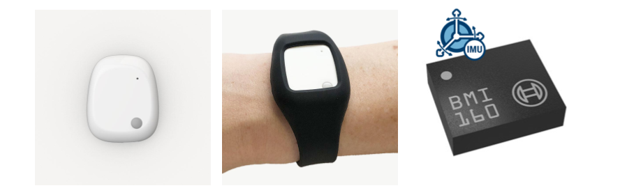

# AIoT Course - Project 2 (Human Gesture Recognition Project)

**An End-to-end Artificial Intelligence of Things Project**

## About this Project

* A team of a max of **3 students** is mandatory for each project
* Announcement date: **20 April, 2026** 
* Delivery Date: **25 May, 2026, 23:59**
* Grade: **40%**

## Project Description

In this project, you are prompted to create an end-to-end Artificial 
Intelligence of Things (AIoT) procedure in order to recognize a set of gestures 
automatically. This problem is identified as Human Gesture Recognition (HGR), 
which is actually the technology that uses sensors to read and interpret hand 
gestures as commands. Nowadays, HGR has multiple uses in various domains, such 
as healthcare, industry, gaming, etc. In the automotive industry, for instance, 
this capability allows drivers and passengers to interact with the vehicle — 
usually to control the infotainment system without touching any buttons or 
screens.

In particular, you will take advantage of the Mbientlab’s sensorial device, 
MetaMotionR research sensor kit [1], and its wristband [2], which is a 
wrist-worn device that provides recorded (logging) or real-time (streaming) 
sensor data. The sensor kit embeds the Bosch BMI160 Inertial Measurement Unit 
(IMU), which is a small, low-power, low-noise 16-bit inertial measurement unit 
designed for use in mobile applications like augmented reality or indoor 
navigation, which require highly accurate, real-time sensor kinesiological 
data. In full operation mode, the user can enable both the accelerometer and 
gyroscope sensors to collect the movement data. The device, the wristband, and 
the embedded IMU are presented in Figure 1. 

For the data collection procedure, you can utilize the mobile and desktop 
open-source applications (MetaWear, MetaBase) that Mbientlab provides in the 
Apple Store (Mac, iPhone), the Play Store, and the Windows Store:

* [Mbientlab MetaWear and MetaBase Apps for iOS and macOS on App Store](https://apps.apple.com/us/developer/mbientlab-inc/id920878580)
* [Mbientlab MetaWear App on Play Store](https://play.google.com/store/apps/details?id=com.mbientlab.metawear.app)
* [Mbientlab MetaBase App on Play Store](https://play.google.com/store/apps/details?id=com.mbientlab.metawear.metabase)
* [Mbientlab MetaBase on Microsoft Store](https://apps.microsoft.com/store/detail/metabase/9NBLGGH4TXJ3)

As an alternative option, you can use the MetaWear APIs the company provides 
in Java, Swift, JavaScript, Python, and C++ programming languages:

* [MetaWear APIs](https://mbientlab.com/tutorials/MetaWearAPI.html)

*Figure 1. From left to right. a) the MetaMotionR research sensor kit, 
b) its wristband, and, c) the embedded Bosch BMI160 Inertial Measurement Unit 
(IMU).*

After collecting the data, you will proceed with data engineering and 
preparation methodologies in order to transform the data into a suitable 
format capable of training the AI models. Then, you will select between a set 
of supervised-learning Machine Learning models for the learning procedure, 
and finally you will evaluate the AI models with respect to their performance.

You will train the ML models in two ways:
1. by feeding the ML algorithms with segmented-windowed data
2. by generating a set of features (feature engineering), and then, feeding the
ML models

It is suggested to read the whole papers that are provided in the "References" 
section in order to better understand the identification scenario.

## Gesture Definition and Execution

**For the learning scenario, you will perform the activities described below:** 

*Using the smart wearable device, you will be recording standard smartphone 
gestures commonly used while navigating social media. Please follow these 
descriptions and guidelines carefully to ensure uniform data collection across 
all groups.*

You will collect data for five distinct gestures. Ensure the subject performs 
these as naturally as they would when browsing a social media feed 
(e.g., Instagram, TikTok, or X).

1. Scroll Up
   * Action: The user places their finger on the screen and drags it downward 
   to move the on-screen content up (revealing older or lower content). 
   * Requirement: Define and record whether the subject is using their thumb 
   or index finger.

2. Scroll Down 
   * Action: The user places their finger on the screen and drags it upward to 
   move the on-screen content down (revealing newer or higher content). 
   * Requirement: Define and record whether the subject is using their thumb or 
   index finger.

3. Swipe Left
   * Action: A horizontal swipe where the finger starts on the right side of 
   the screen and quickly glides to the left (commonly used to view the next 
   photo in a carousel or move to the next tab). 
   * Requirement: Define and record whether the subject is using their thumb 
   or index finger.

4. Swipe Right 
   * Action: A horizontal swipe where the finger starts on the left side of 
   the screen and quickly glides to the right (commonly used to go back a page 
   or view a previous photo). 
   * Requirement: Define and record whether the subject is using their thumb 
   or index finger.

5. Texting
   * Action: Typing a standard message on the smartphone's virtual keyboard. 
   * Requirement: The subject should type naturally and continuously (e.g., 
   copying a provided block of text or writing stream-of-consciousness) for 
   the recording intervals. Two-handed thumb typing or single-handed typing 
   is acceptable, but the typing style should ideally be noted in your project 
   log.

## Instructions for data collection and annotation

### Part 1: Requirements & Structure

Based on your gestures collection definition, please use the accelerometer 
and/or gyroscope.

1. You familiarize yourself with the wearable and select one or more of its sensors 
that indicate movement, i.e., accelerometer and/or gyroscope.
2. To properly collect the instances, you must be careful that the data contains 
exactly the instances of interest. This means that the recording of the data 
collection must start while you perform the gesture repetitively, and 
terminate the recording before you stop performing the gesture.
3. Time Requirements & Structure:
   * Time per Gesture: 5 minutes per subject. 
   * Total Time per Subject: 25 minutes (5 gestures × 5 minutes each). 
   * Total Time per Group: 1 hour and 15 minutes (75 minutes), assuming 3 
   subjects per group.
4. You collect and annotate the data based on the gesture classes you want to 
train the AI model. 
5. Visualize the sensor data in the following ways: 
   * Accelerometer data (3-axis).
   * Gyroscope data (3-axis).
   * Accelerometer and Gyroscope data (6-axis).

**Note: Collect a representative dataset, meaning each class should have 
almost the same time-length of instances in total.**

### Part 2: Recording Guidelines

To maintain data integrity, do not mix gestures in a single recording.

* Standalone Collection: Each recording must capture strictly one specific 
gesture at a time. 
* Repetitive Cycles: Break the 5-minute requirement into manageable, repetitive 
cycles. *Example: Record 20 seconds of continuous "Scrolling Up", stop the 
recording, take a brief pause, and repeat another 20-second recording until 
you have accumulated the required 5 minutes of data for that specific gesture.*
* Documentation: For scrolling and swiping, you must strictly define and log 
whether the subject is using their thumb (typical of one-handed use) or their 
index finger (typical of two-handed use). The subject should remain consistent 
with the chosen finger for the duration of that specific gesture's recording.

## Configuration

As the majority of software projects work with configuration files to set up 
the instantiation of their components or experiments, we follow the same 
principle in this project too.

Thus, we provide you with a configuration file as an indicator of how to set up
your project. This file should contain all the parameters set up that are 
utilized for the project. To use this file, please copy and rename the 
`config.yml.template`, which is located in the root directory, to `config.yml`.

Additionally, the file should comprise all parameters regarding the MongoDB 
host, the database name, the collection name, as well as parameters about the 
data engineering and the learning processes.

## Dataset creation

1. Follow the folder and files structure guideline, which can be found 
in `data/README.md`.
2. The data that is related to the gestures collection process before you upload 
it to the database will be stored inside the `data` folder.
3. Instantiate a `mongod` primary daemon process for the MongoDB system.
4. Based on the instructions in `aiot_dataset_creation_sample.ipynb`:
   * Create the database and the collection where you will save your data. 
   * Transform the data into the proper MongoDB document format. 
   * Upload the data to your collection.
* The sampling frequency (sampling rate) should be at 100Hz.

Note: Use the MongoDB Compass GUI to check your database and collections:

* https://www.mongodb.com/products/tools/compass
    
## Exploratory Data Analysis and Data Processing

As it was described in the "Project Description" section, two different ML
solutions will be provided:
* feed the ML algorithms with segmented-windowed data. To help you with the 
process, you can study the publication [7] in the "References" section. 
* generate a set of features (feature engineering), and then feed the
ML models. Accordingly, you can study publication [4] as a guide.

Thus, you will create two different Jupyter Notebooks that correspond to each 
ML solution:

1. `aiot_project_time_series.ipynb`
2. `aiot_project_feature_engineering.ipynb`

Check, for example, the `aiot_project_sample.ipynb`.

### Data Exploration

For the Exploratory Data Analysis (EDA) and the Data Engineering process for 
both a single instance and the whole dataset, please follow the instructions 
below. In particular, according to this step, you are prompted to implement 
and run the following steps (the order is indicative):

* Provide a barplot that contains the time-length of the collected instances 
for each class.
* Time-series segmentation: Split the data into fixed windows of X seconds 
with X% overlap (in samples). 
* Provide a barplot with the count of instances that occurred after this 
process, for each class. 
* Filter the data with a low-pass filter at a frequency of *X* Hz.
* Visualize a time-series instance of the transformed dataset to see the 
effect of the filter on the signal. 
* Detect outliers and/or find missing values.

### Data Transformation

* Provide the input vector of the segmented windows.
* Provide the input vector after feature engineering. Which features are 
discriminative and useful for the model? 
* For the extracted feature set, determine which features to keep (feature selection).
* Perform dimensionality reduction (if needed) by using Principal Component 
Analysis (PCA).

### Data Preparation

1. Split the data into train and test sets. Two subjects from the team will 
compose the train set and one the test set.
2. Use a scaling algorithm to scale the data into a standard value range 
(for instance, Standardization, Min Max Normalization). Exploit Python's 
`scikit-learn` library.

## Learning Process (ML Modeling)

1. Select a supervised Machine Learning approach to perform the gesture 
recognition scenario, by exploiting Python's `scikit-learn` library. For 
instance, you can use the Support Vector Machine (SVM) algorithm, Random Forests, 
or other models.
2. Fit the data into the model. 
3. Evaluate the ML model performance in the form of Confusion Matrix and 
Classification Report by using the evaluation metrics that arise from the 
True Positives, False Positives, True Negatives, False Negatives 
classification results. 
4. Explore and understand the data adequately and provide your insights.
5. Fine-tune the ML model (e.g., use Exhaustive Grid Search algorithm). Exploit 
Python's `scikit-learn` library.

## Report

**You will provide us with a link that leads to a downloadable `.zip` file
(e.g., Google Drive or OneDrive) that will contain**:

* The **code** of the project.
* The collected **dataset** with its annotated metadata is in the `data` folder.
* A **2-page report** related to the data collection procedure, the classes, 
how the data was annotated, the controlled environment, how you trained the
AI model, and interpreting also the results of the evaluation process.

Some additional useful information about the report is provided below.

Code Information:
* The code used to convert the CSV data into a format (data engineering, data 
preparation), capable of training the models.
* The code used to train and evaluate the models. 
* The high-level code could be in notebooks, while the functions could be in scripting 
format.
* `README.md` file with instructions on how to automatically run the code 
should be delivered: data loading, data processing, model training, and model 
evaluation process.
* The `README.md` should describe clearly how you performed the gestures' 
collection procedure (maybe a Figure too).
* The code should be well-documented and commented.
* Provide your results of the training and data exploration using `.png` files.

Documentation:
* A short documentation, max of 2 pages, in `.docx` format.
* For **all** the members of your team, you should include the following: First Name, 
Last Name, email, and phone number.
* Describe the process that you took to convert the data and generate the model. 
Include your observations on the accuracy of the model regarding the classes’ 
identification. 
* **Interpret the results!!**: 
   * You should include the main information in the 
Notebooks and at a more abstract level in the report document (`.docx` file - 
see the instructions below).
  * Compare and explain the differences in the performance metrics between the 
  different ML solutions.
* If the `.docx` file is not possible, you can use a `PDF` file.
* The documentation should be in English and should be written in a 
professional manner.
* The documentation should be in a single file, not in multiple files.
* If the `.docx` file is more than 1 page, you will lose points.

## Technologies

The following list provides all the necessary Python packages that can be 
exploited for the project's needs:

* Data Engineering: NumPy, SciPy, pandas 
* Data preparation: scikit-learn
* Visualization: Matplotlib, seaborn, pandas
* AI modeling: scikit-learn 

An indicative Python environment setup can be found in the 
`requirements.txt` file in the root directory.

If you need some extra knowledge of how to utilize Pandas, NumPy, MatplotLib, 
seaborn, scikit-learn, and other Data Science stuff, you can read and 
experiment with the tutorials that can be found here:

* [Python Data Science and Machine Learning Tutorials](https://github.com/tzamalisp/data-science-and-machine-learning-tutorials)

## Important Notes (READ THIS CAREFULLY)

* You can write your own functions in the `utils.py` or `utils_visual.py` 
or modify the existing ones. The code in these files is indicative. 
* If any changes take place in these two files, keep in mind to write down the 
proper documentation, as well as the docstrings in the same Python Style 
Format (Google) that is included in the project announcement.
* The high-level project's code (function imports) should run in the Jupyter 
Notebook.
* You can select and deploy any of the ML models that are presented 
in the literature section.
* The project should be implemented in Python 3.11 or higher.
* **Modify** the `requirements.txt` file to contain the latest versions of the 
libraries you use and disable compatibility issues between them.

## References

[1] "MMR – MetaMotionR," Mbientlab, [Online]. Available: https://mbientlab.com/store/metamotionr/.

[2] Mbientlab, "Wrist Band Kit for MMC and MMR," Mbientlab, [Online]. Available: https://mbientlab.com/store/wristband-sensor-research-kit/.

[3] Tzamalis, Pantelis, Sotiris Nikoletseas, and Paul G. Spirakis. "Gestureset: Public domain dataset for human gesture 
recognition using wrist-worn devices: A preliminary version." In 2023 19th International Conference on Distributed 
Computing in Smart Systems and the Internet of Things (DCOSS-IoT), pp. 404-413. IEEE, 2023.

[4] Aggelides, Xenophon, Andreas Bardoutsos, Sotiris Nikoletseas, Nikos Papadopoulos, Christoforos Raptopoulos, and 
Pantelis Tzamalis. "A gesture recognition approach to classifying allergic rhinitis gestures using wrist-worn devices: 
a multidisciplinary case study." In 2020 16th International Conference on Distributed Computing in Sensor Systems (DCOSS), 
pp. 1-10. IEEE, 2020.

[5] Iyer, Darshan, Fahim Mohammad, Yuan Guo, Ebrahim Al Safadi, Benjamin J. Smiley, Zhiqiang Liang, and Nilesh K. 
Jain., "Generalized hand gesture recognition for wearable devices in IoT: Application and implementation challenges.," 
in Machine Learning and Data Mining in Pattern Recognition: 12th International Conference, MLDM 2016, New York, NY, 
USA, 2016. 

[6] Xu, Chao, Parth H. Pathak, and Prasant Mohapatra., "Finger-writing with smartwatch: A case for finger and hand 
gesture recognition using smartwatch," in 16th International Workshop on Mobile Computing Systems and Applications, 2015. 

[7] Liu, Fang-Ting, Yong-Ting Wang, and Hsi-Pin Ma., "Gesture recognition with wearable 9-axis sensors.," in 
International Conference on Communications (ICC), 2017.

[8] Zhu, Peide, Hao Zhou, Shumin Cao, Panlong Yang, and Shuangshuang Xue., "Control with gestures: A hand gesture 
recognition system using off-the-shelf smartwatch.," in IEEE, 4th International Conference on Big Data Computing and 
Communications (BIGCOM), 2018. 

[9] Tzamalis, Pantelis, Andreas Bardoutsos, Dimitris Markantonatos, Christoforos Raptopoulos, Sotiris Nikoletseas, 
Xenophon Aggelides, and Nikos Papadopoulos., "End-to-end Gesture Recognition Framework for the Identification of 
Allergic Rhinitis Symptoms.," in 2022 18th International Conference on Distributed Computing in Sensor Systems (DCOSS), 
Marina del Rey, Los Angeles, CA, USA, 2022. 

[10] Tzamalis, Pantelis, "Python Data Science and Machine Learning Tutorials", [Online]. 
Available: https://github.com/tzamalisp/data-science-and-machine-learning-tutorials

## Contact

Dr. Pantelis Tzamalis, *Engineering Manager*
* email: [tzamalis@ceid.upatras.gr](mailto:tzamalis@ceid.upatras.gr)
* GitHub: [https://github.com/tzamalisp](https://github.com/tzamalisp)
* Website: [https://tzamalisp.github.io)](https://tzamalisp.github.io)
* Social: [https://www.linkedin.com/in/pantelis-tzamalis/](https://www.linkedin.com/in/pantelis-tzamalis/)

George Kontogiannis, *Ph.D. Candidate*
* email: [george.k.kontogiannis@gmail.com](mailto:george.k.kontogiannis@gmail.com)
* GitHub: [https://github.com/gkontogiannhs](https://github.com/gkontogiannhs)
* Social: [https://www.linkedin.com/in/george-kontogiannis/](https://www.linkedin.com/in/george-kontogiannis/)
