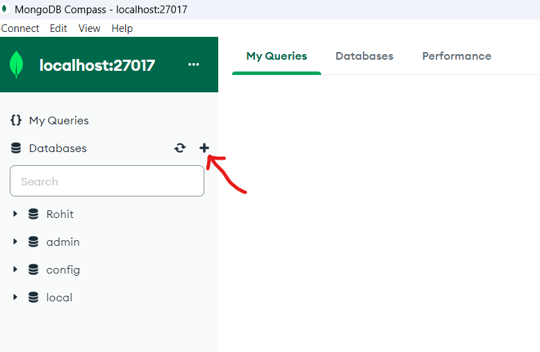
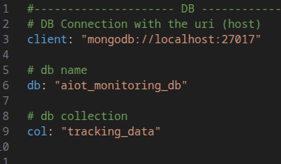
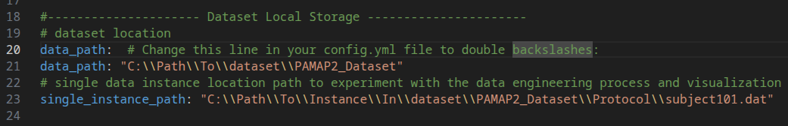

# AIoT-Project

The project we made for the undergraduate elective course Artificial Inteligence Algorithms and Implementations for the Internet of Things (CEID1185). The project tested our ability to import a dataset into MongoDB, extract, explore, analyse, and process that data, and use it to train a ML model.

# Dependencies.

- You will need to have a [Python](https://www.python.org/downloads/) interpreter installed, we implemented the project in version `3.14+`.
- A big part of this project depends on `.ipynb` notebooks. You may use any interpeter you prefer though we personally used [Visual Studio Code](https://code.visualstudio.com/download) with [Jupyter](https://jupyter-notebook.readthedocs.io/en/latest/#). You may install the Jupyter extention [here](https://marketplace.visualstudio.com/items?itemName=ms-toolsai.jupyter).
- Finally you will need [MongoDB](https://www.mongodb.com/try/download/community). We used version `7.0.34`.

# Setup

Navigate to a directory of your choice and clone this repository.

```bash
git clone https://github.com/billystein25/AIoT-Project.git
cd AIoT-Project
```

Install the required Python modules.

```bash
pip install -r requirements.txt
```

You will also need the dataset which you can download from [here](https://archive.ics.uci.edu/dataset/231/pamap2+physical+activity+monitoring).

This is the folder layout we used:

```
AIoT-Project
└── data/
    ├── README.md
    └── PAMAP2_Dataset/
        ├── readme.pdf
        ├── DataCollectionProtocol.pdf
        ├── DescriptionOfActivities.pdf
        ├── PerformedActivitiesSummary.pdf
        ├── subjectInformation.pdf
        ├── Protocol/ 
        │   ├── subject101.dat
        │   ├── ...
        │   └── subject109.dat
        └── Optional/ 
            ├── subject101.dat
            ├── ...
            └── subject109.dat
```

Next you will need to set up a MongoDB database and collection. If you are using Compass then this is easy. Connect to your databases and create a new collection. 



With the collection set you should head back in the working directory of the project and open config.yml in a text editor. Make sure the client uri, the database name, and the database collection name match what you inputed in the previous step.



Finally scroll down and input the proper directory for the dataset location. In my case the dataset was stored in `"G:\\AIoT-Project\\data\\PAMAP2_Dataset"`



You may change the rest of the config settings, or leave them at the ones we used for our evaluations.

# Usage

This project is comprised of 3 main Notebook files. First open `aiot_dataset_creation.ipynb` in your interpreter of choice and execute the whole file. Once the execution is complete the data of the Protocol split should be imported into your MongoDB database. With our configuration settings you should see 324 entries. With the database populated you can move on to the next two notebooks.

The next notebook to execute notebook `aiot_project_time_series.ipynb`. This will connect to the database you previously created, fetch the documents, and convert them to `pandas.DataFrame` objects to be processed. During the preprocessing phase the dataframe is split into two sectors, Train and Test Split. We then perform a windowing action for each dataframe by attaching to each window the metadata of each subject as well as their performed activities. Additionally we apply the Butterworth filter to both sets and check for any `NaN` values. Following that we apply the filtered data over the Time Series pipeline. We achieve that by using `sklearn.model_selection.GridSearchCV` to find the optimal set of parameters. The searching may take about 10 minutes.

The final notebook is `aiot_project_feature_engineering.ipynb`. The fetching of the data and the preprocessing phase are identical to the previous notebook. The difference comes in the ML pipeline used: Feature Engineering. This results in much more accurate training orbiting around feature extraction with features from time domain and frequency domain. Notice the higher `f1-score` on the accuracy metric.

# Sensor Configurations Evaluated

We decided to evaluate the protocol activities dataset for the hand position of the IMU with the ±16g Accelerometer and Gyroscope sensors. The activities contained in the Protocol section are the following: `Nordic walking`, `ascending stairs`, `cycling`, `descending stairs`, `ironing`, `lying`, `rope jumping`, `running`, `sitting`, `standing`, `vacuum cleaning`, `walking`. 
Subjects in the range [101~105] and [107] were used for training purposes, while the subjects' 106, 108, 109 activities for testing purposes.

